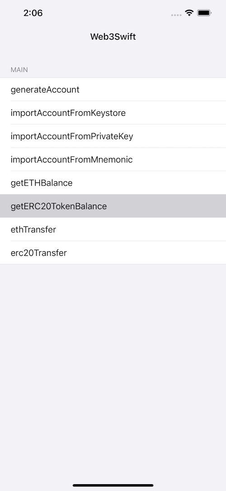

# EtherWallet
**EtherWallet** is an iOS toolbelt for interaction with the Ethereum network.


[](https://www.apple.com/nl/ios/)&nbsp;
[](https://www.swift.org/getting-started/#using-the-package-manager)



For more specific usage, please refer to the [demo](https://github.com/smithSophiav/EtherWallet/tree/main/Demo)

### Swift Package Manager
The Swift Package Manager  is a tool for automating the distribution of Swift code and is integrated into the swift compiler.

Once you have your Swift package set up, adding SDBridgeSwift as a dependency is as easy as adding it to the dependencies value of your Package.swift.
```ruby
dependencies: [
    .package(url: "https://github.com/smithSophiav/EtherWallet.git", .upToNextMajor(from: "1.0.4"))
]
```
### Example usage

```swift
import EtherWallet
```

##### Setup Web3_v1
```swift
let web3 = Web3_v1()
if web3.isWeb3LoadFinished {
} else {
    web3.setup { [weak self] web3LoadFinished in
        guard let self = self else { return }
        if web3LoadFinished {}
    }
}
```

##### generate Account
```swift
web3.generateAccount(password: password) { [weak self] (state, address,mnemonic,privateKey, keystore,error) in
    guard let self = self else { return }
    self.generateAccountBtn.isEnabled = true
    if state {
        let text =
        "address: " + address + "\n\n" +
        "mnemonic: " + mnemonic + "\n\n" +
        "privateKey: " + privateKey + "\n\n" +
        "keystore: " + keystore
        generateAccountTextView.text = text
    } else {
        generateAccountTextView.text = error
    }
}
```

##### Import Account From Mnemonic 
```swift
web3.importAccount(mnemonic: mnemonic, encrypedPassword: encrypedPassword){ [weak self] (state,address,privateKey,keystore,error) in
guard let self = self else { return }
self.importAccountBtn.isEnabled = true
if state {
    let text =
        "address: " + address + "\n\n" +
        "privateKey: " + privateKey + "\n\n" +
        "keystore: " + "\n" + keystore
    self.importAccountTextView.text = text
} else {
    self.importAccountTextView.text = error
}
}
```

##### Import Account From Keystore
```swift
web3.importAccount(decryptPassword: password, keystore: Keystore) { [weak self] (state, address, privateKey,error) in
guard let self = self else { return }
self.importAccountBtn.isEnabled = true
if state {
    let text =
        "address: " + address + "\n\n" +
        "privateKey: " + privateKey
    self.importAccountTextView.text = text
} else {
    self.importAccountTextView.text = error
}
}
```


##### Import Account From PrivateKey
```swift
web3.importAccount(privateKey: privateKey, encrypedPassword: password){ [weak self] state, address, keystore,error in
guard let self = self else { return }
self.importAccountBtn.isEnabled = true
if state {
let text =
    "address: " + address + "\n\n" +
    "keystore: " + "\n" + keystore
     self.importAccountTextView.text = text
} else {
     self.importAccountTextView.text = error
 }
}
```

##### Send ETH
```swift
web3.ETHTransfer(recipientAddress: reviceAddress,
             amount: amountText,
             senderPrivateKey: privateKey,
             providerUrl: providerUrl) { [weak self] (state,txid,error) in
guard let self = self else { return }
print("state = \(state)")
print("txid = \(txid)")
if state {
    self.hashLabel.text = txid
} else {
    self.hashLabel.text = error
}
}
```
##### Send ERC20
```swift
web3.erc20TokenTransfer(providerUrl: providerUrl,
                    senderPrivateKey: privateKey,
                    recipientAddress: reviceAddress,
                    erc20ContractAddress: contractAddress,
                    amount: amountText,
                    decimal: 6.0) { [weak self] (state,txid,error) in
guard let self = self else { return }
print("state = \(state)")
print("txid = \(txid)")
if state {
    self.hashLabel.text = txid
} else {
    self.hashLabel.text = error
}
}
```

For more detailed usage methods, it is recommended to refer to [demo](https://github.com/smithSophiav/EtherWallet/tree/main/Demo)

## License

EtherWallet is released under the MIT license. [See LICENSE](https://github.com/smithSophiav/EtherWallet/blob/main/LICENSE) for details.
