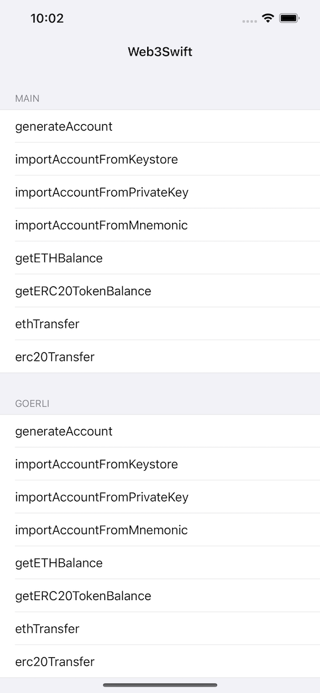

# EtherWallet
**EtherWallet** is an iOS toolbelt for interaction with the Ethereum network.


[](https://www.apple.com/nl/ios/)&nbsp;
[](https://www.swift.org/getting-started/#using-the-package-manager)



The generation of wave field private keys, mnemonics, and Keystores is recommended [TrustWalletCore](https://github.com/trustwallet/wallet-core)

For more specific usage, please refer to the [demo](https://github.com/smithSophiav/EtherWallet/tree/main/Demo)

### Swift Package Manager
The Swift Package Manager is a tool for automating the distribution of Swift code and is integrated into the swift compiler.

Once you have your Swift package set up, adding SDBridgeSwift as a dependency is as easy as adding it to the dependencies value of your Package.swift.
```ruby
dependencies: [
    .package(url: "https://github.com/smithSophiav/EtherWallet.git", .upToNextMajor(from: "1.0.2"))
]
```
### Example usage

```swift
import EtherWallet
```

##### Setup Web3_v1
```swift
let web3 = Web3_v1()
if web3.isWeb3LoadFinished {
} else {
    web3.setup { [weak self] web3LoadFinished in
        guard let self = self else { return }
        if web3LoadFinished {}
    }
}
```

##### Send ETH
```swift
guard let reviceAddress = reviceAddressField.text,
let amountText = amountTextField.text, let privateKey = privateKeyTextView.text else { return }
let providerUrl = MainNet
web3.ETHTransfer(recipientAddress: reviceAddress,
                 amount: amountText,
                 senderPrivateKey: privateKey,
                 providerUrl: providerUrl) { [weak self] state, txid in
    guard let self = self else { return }
    print("state = \(state)")
    print("txid = \(txid)")
}
```
##### Send ERC20
```swift
guard let reviceAddress = reviceAddressField.text,
let contractAddress = erc20AddressTextField.text,
let amountText = amountTextField.text,
let privateKey = privateKeyTextView.text else { return }
let providerUrl = MainNet
web3.erc20TokenTransfer(providerUrl: providerUrl,
                senderPrivateKey: privateKey,
                recipientAddress: reviceAddress,
                erc20ContractAddress: contractAddress,
                amount: amountText,
                decimal: 6.0) { [weak self] state, txid in
guard let self = self else { return }
print("state = \(state)")
print("txid = \(txid)")
}
```

For more detailed usage methods, it is recommended to refer to [demo](https://github.com/smithSophiav/EtherWallet/tree/main/Demo)

## License

EtherWallet is released under the MIT license. [See LICENSE](https://github.com/smithSophiav/EtherWallet/blob/main/LICENSE) for details.
